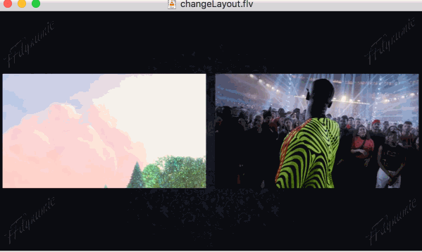

[](https://travis-ci.org/Xingtao/FFdynamic)

### FFdynamic - Extend FFmpeg with run time control and dynamic audio/video composition

This project shipped with two parts: **FFdynamic** library and applications build on **FFdynamic**

------------
### Contents
- [An application *Interactive Live*](#an-application-interactive-live)
- [*Dynamic Detect* example](#dynamic-detect-example)
- [FFdynamic library Overview](#ffdynamic-library-overview)
- [Getting start with a simple application *Transcoding*](#getting-start-with-a-simple-application-transcoding)
- [Write a plugin component](#write-a-plugin-component)
- [Installation](#installation)
- [Contribution](#contribution)

-----------
## An application *Interactive Live*

**Interactive Live** (ial for short) is an application based on FFdynamic.  
Ial does multiple video and audio input mixing, then streams it out. It could be run on phones or cloud servers.  

**ial** gives flexiable control over the mixing process (dynamical layout change, backgroup picture change, mute/unmute, etc..), shown in the following gif:


#### *Layout auto change or set to certain pattern during mixing by request*
This picture shows, 1. auto layout change when a new stream joining in (from 2 cells to 3 cells); 2. layout changes to 4 and 9 cells by http requeset. Changes are quite smooth, without any frozen or stuck, due to audio/video sync message communication mechnism.

#### For more details(capacities, http apis, etc..), please refer to [the application](apps/interactiveLive/README.md)

-----------
## *Dynamic Detect* example

**Dynamic Detect** is a playgroud one can change object detector types at run time while reading online video streams or local files. Those detectors are loaded via OpenCV api. Models of *darknet* yolo3, *caffe* vgg-ssd, and *tensorflow* mobilenet-ssd (all in coco dataset) are tested. Here is an output stream gif, which run 2 detecors in parallle, draw boxes and texts when they locate interested objects.


#### For more details, please refer to [the application](apps/dynaDnnDetect/README.md) and its unit [test](modules/moduleTest/testCvDnnDetect.cpp)

-----------------

### `FFdynamic library Overview`

* **Extending**: FFdynamic extends FFmpeg in the manner of doing video/audio process **compositionally** and each component's state can be **dynamically** changed on the fly.

- **compositional**
  _FFdynamic_ is structured in a modular way. It takes each component (demux, decode, filter, encode, muxer, and cutomized component) as a building block and they can be combined together as desired at creationg time or run time.  
  For instance, if we are developing a dehaze algorithm and would like to know how good the dehazed algorithm visually (in compare to original one). FFdynamic provides facilities that allow one to easily realize following composition:

```
Demux |-> Audio Decode -> |-> Audio Encode ------------------------------------------> |
      |                                                                                | -> Muxer
      |                   |-> Dehaze Filter -> |                                       |
      |-> Video Decode -> |                    | Mix original and dehazed ->| Encode ->|
                          | -----------------> |
```
  As shown, after demux the input stream, we do video decode which will output to two components: 'Dehaze Filter' component and 'mix video' component; after dehaze, its image also output to 'mix video' component, in there we mix original and dehazed image into one. The whole example is [here](#write-a-plugin-component). 
  Normally, one can freely combine components as long as the input data can be processed.

* **on the fly**
  _FFdynamic_ has a runtime event dispatch module, which can pass request to the component needs dynamical state change. For instance, one could set dynamical 'Key Frame' request to video encoder or 'mute' one audio stream.  
  _FFdynamic_ also has a runtime components pub-sub module, which each component can subscribe interesed events from other components. For instance, one video encoder in a live show is willing to know the region of people faces in the incoming image', so that it could set more bitrate to this region. We can do this by subscribe events to a face detecting component and get published event with ROI.

- **customization**
   One can define their own components, for instance
   - a RTP demuxer with private fields
   - an object detection module
   - a packet sending control module
   
   
   Those components are plugins. Once they are done, they can be composed with other components. 

In short, *FFdynamic* is a scaffold allows develop complex audio/video application in a higher and flexiable manner.   
It is suitable for two kind of applications:
* real time audio/video process: live broadcast, video conference backend, transcoding, etc.. with run time control;
* develop new video/audio process algorithm which needs video clips as inputs and video clips as outputs, and communication or coorperation needed between video and audio streams;

-----------
## [Getting start with a simple application *Transcoding*](#getting-start-with-a-simple-application-transcoding)
Do transcoding in a dozen lines of code, [see here](asset/transcode.md)

-----------
## [Write a plugin component](#write-a-plugin-component)

Here we take the 'dehaze', mentioned in the 'Overview' part, as the example. We developed a dehaze algorithm and make it a FFdynamic's component. Then mix original and dehazed image together to check the result visually.

Refer to [here](examplePlugin/README.md) for plugin source files.

-----------
## `Installation`

### Dependency Required
* FFMpeg, glog, cmake (minimal version 3.2)
- compiler supports at least c++11
* boost, protobuf3 (optional, only for the application 'Interactive Live')
- opencv (optional, if you would like to run plugin example)

protobuf3 is not well supports by some linux distributions' package manager, here is a manually compiling script (sudo required):
```
DIR=$(mktemp -d) && cd ${DIR} && \
git clone https://github.com/protocolbuffers/protobuf.git && cd protobuf && \
git submodule update --init --recursive && \
./autogen.sh && ./configure && \
make && make check && \
sudo make install && sudo ldconfig
```

#### For Ubuntu / CentOS
Install FFmpeg as usal, then  

``` sh
apt install -y cmake3 libgflags-dev libgoogle-glog-dev libboost-all-dev
or 
yum install -y glog-devel gflags-devel cmake3 boost-devel  
```

#### For Mac
Install FFmpeg as usal, then  
brew install cmake glog gflags protobuf boost 

### `Docker build`
To alleviate the build process, there is a [docker](tools/dockerlize/README.md) with all dependencies installed that you can play with.

### Build library and apps

``` sh
    Under FFdynamic folder: 
          'sh build.sh'  will build FFdynamic library (need sudo if make install)
    Under app/interactiveLive folder: 
          'sh build.sh'  will build FFdynamic library and ial program.
```

#### Optional Dependencies - TODO
* nvidia driver, cuda tookit, if you prefer using nvidia codec

-----------------
## `Contribution`

All contributions are welcome. Some TODOs:

- A webui that can easily operate on Interactive Live application;
* 'Interactive live' set video cell's border line, border color;
- Statistics for each component, process time, latency time, detailed info, etc..;
* An auto data format negotiate module between components;
- Expose event register to user for easily event/data callback process;
