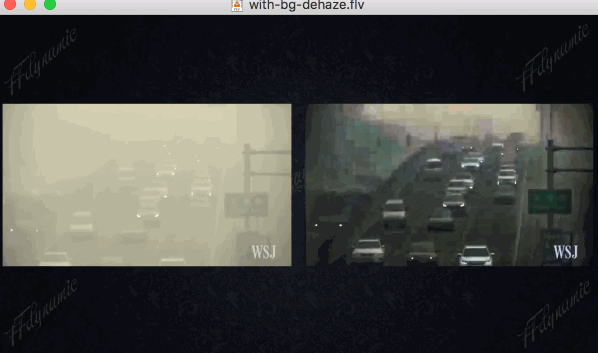

### FFdynamic - Extending FFmpeg's power with video/audio process composition and run time control 
------------
### Contents
- [Overview](#overview)
- [An application Interactive Live](#an-application-interactive-live)
- [Getting start with simple application Transcoding](#getting-start-with-simple-application-transcoding)
  - [Full feature transcoding in a dozen lines of code](#full-feature-transcoding-in-a-dozen-lines-of-code)
  - [Transcoding in parallel](#transcoding-in-parallel)
- [Write a plugin component](#write-a-plugin-component)
- [Installation](#installation)
- [Contribution](#contribution)

-----------
### `Overview`

* **Extending**: FFdynamic extends FFmpeg in the manner of doing video/audio process **compositionally** and each component's state can be **dynamically** changed on the fly.

- **compositional**
  _FFdynamic_ is structured in a modular way. It takes each component (demux, decode, filter, encode, muxer, and cutomized component) as a building block and they can be combined together as desired at creationg time or run time.  
  For instance, if we are developing a dehaze algorithm and would like to know how good the dehazed algorithm visually (in compare to original one). FFdynamic provides facilities that allow one to easily realize following composition:

```
Demux |-> Audio Decode -> |-> Audio Encode -----------------------------------------> |
      |                                                                               | -> Muxer
      |                   |-> Dehaze Filter -> |                                      |
      |-> Video Decode -> |                    | Mix original and dehzed ->| Encode ->|
                          | -----------------> |
```
  As shown, after demux the input stream, we do video decode which will output to two components: 'Dehaze Filter' component and 'mix video' component; after dehaze, its image also output to 'mix video' component, in there we mix original and dehazed image into one. The whole example is [here](#write-a-plugin-component). 
  Normally, one can freely combine components as long as the input data can be processed.

* **on the fly**
  _FFdynamic_ has a runtime event dispatch module, which can pass request to the component needs dynamical state change. For instance, one could set dynamical 'Key Frame' request to video encoder or 'mute' one audio stream.  
  _FFdynamic_ also has a runtime components pub-sub module, which each component can subscribe interesed events from other components. For instance, one video encoder in a live show is willing to know the region of people faces in the incoming image', so that it could set more bitrate to this region. We can do this by subscribe events to a face detecting component and get published event with ROI.

- **customization**
   One can define their own components, for instance
   - a RTP demuxer with private fields
   - a object detection module
   - a packet sending control module
   Those components are plugins. Once they are done, they can be composed with other components. 

In short, *FFdynamic* is a scaffold allows develop complex audio/video application in a higher and flexiable manner.   
It is suitable for two kind of applications:
* real time audio/video process: live broadcast, video conference backend, transcoding, etc.. with run time control;
* develop new video/audio process algorithm which needs video clips as inputs and video clips as outputs, and communication or coorperation needed between video and audio streams;

-----------
## `An application Interactive Live`

Here is an **Interactive Live** (Ial hereafter) application, which is based on FFdynamic and shows how to use this library to develop complicated program.    
It does video and audio mixing, then streams it out. It could be run in phones and cloud servers.
Here is an image got from an mobile app show its using scenario. Two streams are decoded, then mixed together and broadcast to audiences as one stream.

#### **Interactive live scenario**


Besides mixing, **Interactive Live** give more flexiable control over the process (dynamical layout change, backgroup change, mute/unmute, etc..), shown in the Following gifs:

#### **Layout auto change or set to certain pattern during mixing by request**


The above picture shows auto layout change when a new stream joined in (from 2 cells to 3 cells); then manually set the layout to 4 and 9 cells.

#### **Backgroud dynamically change during mixing by request**


The above picture shows backgroud picture changed by a request. 

Both changes are quite smooth, without any stuck or frozen effect.

#### For more details, please refer to [the application](apps/interactiveLive/README.md)

-----------
## **Getting start with simple application Transcoding** 

We start with a simple scenario, transcoding, to take a flavor of FFdynamic.

### **Full feature Transcoding in a dozen lines of code**

```c++
   /* create demux, decode, encode, mux options */
    DavWaveOption demuxOption((DavWaveClassDemux()));
    demuxOption.set(DavOptionInputUrl(), argv[1]);

    DavWaveOption videoDecodeOption((DavWaveClassVideoDecode()));
    DavWaveOption audioDecodeOption((DavWaveClassAudioDecode()));

    DavWaveOption videoEncodeOption((DavWaveClassVideoEncode()));
    videoEncodeOption.setVideoSize(1280, 720);
    videoEncodeOption.setAVRational("framerate", {30000, 1001});
    DavWaveOption audioEncodeOption((DavWaveClassAudioEncode()));

    DavWaveOption muxOption((DavWaveClassMux()));
    muxOption.set(DavOptionOutputUrl(), "test-transcode.flv");

    /* build instances */
    DavDefaultInputStreamletBuilder inputBuilder;
    DavDefaultOutputStreamletBuilder outputBuilder;
    DavStreamletOption inputOption;
    inputOption.setInt(DavOptionBufLimitNum(), 20);
    auto streamletInput = inputBuilder.build({demuxOption, videoDecodeOption, audioDecodeOption},
                                             DavDefaultInputStreamletTag("test_input"), inputOption);
    auto streamletOutput = outputBuilder.build({videoEncodeOption, audioEncodeOption, muxOption},
                                               DavDefaultOutputStreamletTag("test_output"));
    CHECK(streamletInput != nullptr && streamletOutput != nullptr);

    /* connect streamlets and start */
    streamletInput << streamletOutput;
    DavRiver river({streamletInput, streamletOutput});
    river.start();
    ......
```
The source code is [here](FFdynamic/davTests/simpleTranscode.cpp).

This example read an input (local or online stream) then encode it to the format you required (it is just what  transcoding does).

First, we create components by create its option:
``` c++
    DavWaveOption demuxOption((DavWaveClassDemux()));
    demuxOption.set(DavOptionInputUrl, argv[1]);
```
This will create a demux option, and set input url. If we choose FFmpeg's demuxer (also other libav* components, encode, decode, fitler, muxer), we set other demuxer specific options through AVDictionary just the same as FFmpeg, for example, 

```  c++
    demuxOption.set("probesize", "2000000");   // this option will pass to libavformat via AVDictionary
```

Then, no surprising, we create audio/video decode, audio/video encode, and muxer. Each components set desired options.
At this point, no real component is really created, just their options.

``` c++
    DavDefaultInputStreamletBuilder inputBuilder;
    DavStreamletOption inputOption;
    inputOption.setInt(DavOptionBufLimitNum, 20);
    auto streamletInput = inputBuilder.build({demuxOption, videoDecodeOption, audioDecodeOption},
                                             DavDefaultInputStreamletTag("test_input"), inputOption);
```

Here, we use a predefined input streamlet builder to build all components. A streamlet is a set of components, with convinient components' manage functionalities (start, stop, pause, etc.. and input/output data interface).

After build input/output streamlet, connect them by:

``` c++
    streamletInput >> streamletOutput;
```

Finally, we start do the transcoding job by:
``` c++
    DavRiver river({streamletInput, streamletOutput});
    river.start();
```
A *river* is just like a *streamlet* to 'DavWave' component, that it manages streamlet's state.

That is all for transcoding. If one wants more control over the process, dynamically change output bitrate, add outputs streams etc.., you can refer to 'Interactive Live' application. But before that, let's tatke a little bit more about 'Transcoding'.

### **Transcoding in parallel**

We can modify above code a little bit to do multiple resolutions and bitrates output as follow:

``` c++
    DavWaveOption videoEncodeOption1((DavWaveClassVideoEncode()));
    videoEncodeOption.setVideoSize(1280, 720);
    videoEncodeOption.setAVRational("framerate", {30000, 1001});
    DavWaveOption audioEncodeOption1((DavWaveClassAudioEncode()));
    DavWaveOption muxOption1((DavWaveClassMux()));
    muxOption.set(DavOptionOutputUrl, "test-transcode.flv");

    DavWaveOption videoEncodeOption2((DavWaveClassVideoEncode()));
    videoEncodeOption.setVideoSize(1920, 1080);
    videoEncodeOption.set('b', "6000k");
    DavWaveOption audioEncodeOption2((DavWaveClassAudioEncode()));
    DavWaveOption muxOption2((DavWaveClassMux()));
    muxOption.set(DavOptionOutputUrl, "test-transcode-1080p.mp4");

    ////////////////////////////////////////////////////////////////////////////
    DavDefaultOutputStreamletBuilder outputBuilder1;
    DavDefaultOutputStreamletBuilder outputBuilder2;
    auto streamletOutput1 = outputBuilder.build({videoEncodeOption1, audioEncodeOption1, muxOption1},
                                               DavDefaultOutputStreamletTag("test_output_1"));
    auto streamletOutput2 = outputBuilder.build({videoEncodeOption2, audioEncodeOption2, muxOption2},
                                               DavDefaultOutputStreamletTag("test_output_2"));
    CHECK(streamletOutput1 != nullptr && streamletOutput2 != nullptr);
    /* connect streamlets */
    streamletInput >> streamletOutput1;
    streamletInput >> streamletOutput2;

    DavRiver river({streamletInput, streamletOutput1, streamletOutput2});
    river.start();
```
Above code shows one input and two outputs case (useful for adaptive bitrate transcoding), and the code size is still samll. It scales 'linear'.
For performance, each component runs on its own thread, so the whole task is running in parallel.  
On the contrary, FFmpeg do multiple output transcoding in parial parallel:

``` c  FFmpeg.c
static int reap_filters(int flush)
{
    AVFrame *filtered_frame = NULL;
    int i;

    /* Reap all buffers present in the buffer sinks */
    for (i = 0; i < nb_output_streams; i++) {
        OutputStream *ost = output_streams[i];
        OutputFile    *of = output_files[ost->file_index];
        int ret = 0;
        ......
        while (1) {
            double float_pts = AV_NOPTS_VALUE; // this is identical to filtered_frame.pts but with higher precision
            ret = av_buffersink_get_frame_flags(filter, filtered_frame,
                                               AV_BUFFERSINK_FLAG_NO_REQUEST);
            ......
            ......
            switch (av_buffersink_get_type(filter)) {
            case AVMEDIA_TYPE_VIDEO:
                .......
                do_video_out(of, ost, filtered_frame, float_pts);
                break;
```

As shown, if we have 5 outputs (which is normal in live broadcast field, output 1080p60, 1080p30, 720p, 540p, 320p for diffrent devices), FFmpeg will do encode one by one (takes more time, cpu not fully used). Of cause, this is because FFmpeg not targeting this scenario.

-----------
## [Write a plugin component](#write-a-plugin-component)

Here we introduce how to write a plugin. We develop a dehaze algorithm and make it as a FFdynamic's component. Then we could compose it with other components freely. the following image shows the diagram we mentioned above, mix original and dehazed image together to check the result visually.



Refer to [here](#FFdynamic/pluginExample/README.md) for whole plugin sources.

-----------
## `Installation`

### Dependency Required
* FFMpeg, glog, cmake (minimal version 3.2)
- compiler supports at least c++14 (GCC version 5 or above, Clang 3.4 or above, MSVC 19.0 or above)
* boost, protobuf3 (optional, only for the application 'Interactive Live')

protobuf3 is not well supports by some linux distributions' package manager, here is how to manually compile it(sudo required):

```
DIR=$(mktemp -d) && cd ${DIR} && \
git clone https://github.com/protocolbuffers/protobuf.git && cd protobuf && \
git submodule update --init --recursive && \
./autogen.sh && ./configure && \
make && make check && \
sudo make install && sudo ldconfig
```

### Build after install dependencies

``` sh
    Under FFdynamic folder: 'sh build.sh'  will build FFdynamic library.
    Under app/interactiveLive folder: 'sh build.sh'  will build FFdynamic library and Ial program.
```

#### For Ubuntu
Install FFmpeg as usal, then  
apt install -y cmake glog-dev boost-dev

If protobuf3 is not provided via apt, you can refer to this [link](https://gist.github.com/sofyanhadia/37787e5ed098c97919b8c593f0ec44d8)

#### For CentOS
Install FFmpeg as usal, then  
yum install -y glog-devel cmake boost-devel  
For protobuf3 installation, one can refer [here](https://github.com/protocolbuffers/protobuf/blob/master/src/README.md)

#### For Mac
Install FFmpeg as usal, then  
brew install cmake glog protobuf boost 

#### Others 
iOS and Android build is not implemented, pull request is welcome.

#### Optional Installation - TODO
* nvidia driver, cuda tookit, if you prefer using nvidia codec

### `A docker build`
To alleviate the build process, there is a [docker](#tools/dockerlize/README.md) build all dependencies that you can play with.

-----------------
## `Contribution`

Welcome all contributions.
**FFdynamic** still in its early stage, although it is already deploied to thousands of server. Here are some TODO list:

* An auto data format negotiate module between components;
- A webui that can easily operate on Interactive Live application;
* Statistics for each component, process time, latency time, detailed info, etc..;
- Build an ELK, then it is easily to know and analyze running data;
* Nvidia codec supports (it is ongoing, will do it via ffmpeg);
- 'Interactive live' set video cell's border line, border color;
