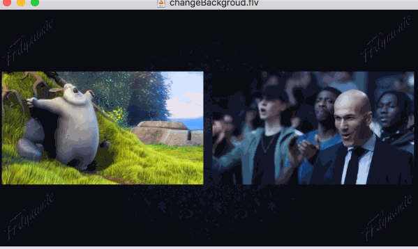

## Interactive Live (Ial)

Interactive live is an full features application based on FFdynamic:
* dynamically join new streams (participant);
* dynamically add new output streams (different video resolution & bitrate);
* dynamically change mix video's layout and backgroud picture;
* dynamically enable/disable(mute/unmute) some participants' audio stream;
* can set video cell's margin (avoid combine video cell's block effect);
* can place each video cell to perticular place (via coordinates);

## Contents
- [Play with the Ial](#play-with-the-ial)
- [Ial Data Flow Diagram](#ial-data-flow-diagram)
- [Ial Settings](#ial-settings)
  - [Layout Pattern Setting of Video Mix](#layout-pattern-setting-of-video-mix)
  - [Streamlet Settings of Ial](#streamlet-settings-of-ial)
- [Http APIs of Ial](#http-apis-of-ial)

-------

## `Play with the Ial`

There is a python script you can play with, named *'testIal.py'*, it is just some http request sending to Ial's http server.
(There is a plan to provide a web ui for convinient of control the 'Ial', however I am not good at web front end work, so contributions are welcome)

Currently, the requests include:
```
        1 -> create room:
        2 -> add new input
        3 -> add new output
        4 -> close one input
        5 -> close one output
        6 -> mute/unmute
        7 -> layout change
        8 -> mix backgroud update
        10 -> ial stop
```

So:
1. run the program: ./ialService ialConfig.json
2. run the test script: python testIal.py
3. send requests: create room, add new inputs/outputs, change layout, etc..
4. check the output files or output rtmp/udp streams, to see the real time changing just made

----

## `Ial Data Flow Diagram`

### 1. Input Streamlet
```
| --demux1 -> video decode1 -> decode-post filter
|          -> audio decode1 -> audio post filter
...
| --demuxN ....... |
```

**Streamlet'** is a set of components: demuxer, video/audio decoder, filters, encoder, muxer, etc..;
A **'Input Streamlet'** is composed of demuxer, video/audio decoder and post decode filter;   
The arrow(->) in above illustration represents data flows. As shown, it starts from demuxer, then video/audio data send to audio/video decoder respectly and each decoder then may outpu to a post filter (optional).

All components are run on parallel, which could speed up the progranm's process.
Note: Each compoent in FFdynamic is a standalone module. They only do data receive, process and send, and know nothing about of its up or down peers. There is a module called Transmitor is in charge of component data/event passing.

### 2. MixStreamlet

#### Video Mix: raw yuv data -> scale to cell fit layout -> do video mix -> post video filter -> output
```
--InputStreamlet1--> |------------------------------------| ---> |------------------|
                     | scale1 -> |--------|   |Video------|      | OutputStreamlet1 |
--InputStreamlet2--> | scale2 -> |VideoMix|-->|Post-filter| ---> | ................ |
                     | scaleN -> |________|   |___________|      | OutputStreamletN |
--InputStreamletN--> |____________________________________| ---> |__________________|
```

#### Audio Mix: raw pcm data -> resample to dst audio fmt -> do audio mix -> post audio filter -> output

```
--InputStreamlet1--> |----------------------------------------| ---> |------------------|
                     | resample1 -> |--------|    |Auido------|      | OutputStreamlet1 |
--InputStreamlet2--> | resample2 -> |AudioMix| -->|Post-filter| ---> | ................ |
                     | resampleN -> |________|    |___________|      | OutputStreamletN |
--inputStreamletN--> |________________________________________| ---> |__________________|
```

**'Mix Streamlet'** receive audio/video raw data from 'Input Streamlet', and ouptut mixed data to 'Output Streamlet';  
Video Mix and audio mix has communication via a unified event pub-sub module (audio mix subscribe video mix event);  
Video Mix sends each incoming stream's mix info (video mix pts, stream's current pts) which audio mix uses them to do
stream level (each input's audio & video) sync and mix level (audio mix & video mix) sync;

### OutputStreamlet

##### PreEncode Filter -> Encode --> Mux

```
Output1:
    |-----------------     |-------|      |------|
--> |PreEncode Filter| --> |Encode1| ---> | Mux1 |
    |-----------------     |-------|      | .... |
                                          | .... |
    |-----------------     |-------|      | ...  |
--> |PreEncode Filter| --> |EncodeN| ---> | MuxN |
    |-----------------     |-------|      |----  |

......
Output2
......
OutputN

```

A **'Output Streamlet'**  takes mixed audio and video data, do filterring (optional), encode, and finally mux to streams required. Each 'Output Streamlet' has only one video/audio encoder, but can hanve several muxers.

----

## `Ial Settings`

All InteractiveLive settings are palced in 'protos' folder as protobuf messages,   
if you are familiar with it, check this folder directly.

-----------

### Layout Pattern Setting of Video Mix

    *Layout Info* specifies one room's output screen layout.
    The default layout type is 'auto', which will change according incoming participants.

| participants | layout pattern         | mark                                             |
|:-------------|:-----------------------|:-------------------------------------------------|
| 1            | eSingle_1              | no margin, not padding, whole screen             |
| 2            | eHorizonal_2           |                                                  |
| 2            | eLeft1SmallRight1Big_2 | a small one in uppper left, and big one in right |
| 3            | eLeft2SmallRight1Big_3 |                                                  |
| 4            | eEqual_4               |                                                  |
| 4            | eLeft1BigRight3Small_4 |                                                  |
| 5            | eEqualCenter_5         | four corners and one in center                   |
| 6            | eRow2Col3_6            | 2x3 grid                                         |
| 7            | eEqual_9               | 3x3 grid                                         |
| 8            | eEqual_9               | 3x3 grid                                         |
| 9            | eEqual_9               | 3x3 grid                                         |
| 10           | eRow3Col4_12           | 4x3 grid                                         |
| 11           | eRow3Col4_12           | 4x3 grid                                         |
| 12           | eRow3Col4_12           | 4x3 grid                                         |
| 13           | eEqual_16              | 4x4 grid                                         |
| 14           | eEqual_16              | 4x4 grid                                         |
| 15           | eEqual_16              | 4x4 grid                                         |
| 16           | eEqual_16              | 4x4 grid                                         |

### Streamlet Settings of Ial

There are three types of streamlet setting for ial: input, output and mix;

#### Input Streamlet Settings

**Input Streamlet Settings** is a set of settings composed by 'demux', 'post_decode_video_filter', 'post_decode_audio_filter', 'video_decode' and 'audio_decode';

Take 'demux' for example; its proto3 format is:

```
message DemuxSetting {
    string demux_type = 1;  /* values: auto, ffmpeg, or your own defined demuxer name. auto will use ffmpeg */
    bool input_fps_emulate = 2; /* whether emulate input framerate, useful for file like inputs */
    int32 read_timeout = 3; /* network protocals read timeout, in second */
    int32 reconnect_times = 4; /* reconnect times if encounter disconnection, include EOF */
    map<string, string> avdict_demux_option = 5; /* options that ffmpeg's demuxer can set via AVDict */
}
```

As shown, there are three parts of options: "*"
* what type to use: normally use ffmpeg; and you can define your own implementations; 'auto' is syntax sugar, normally will choose 'ffmpeg';
* component(demuxer, decoder, etc..) level options: control the behaviors of this component;
* ffmpeg level options: options set via AVDictionary to libavcodec, libavformat, libavfilter, etc..  
some options we are familiar with may not work for they are ffmpeg program specific, not libav*;

#### Output Streamlet Settings

```
message OutputStreamletSetting {
    DavWaveSetting.VideoEncodeSetting video_encode = 1;
    DavWaveSetting.AudioEncodeSetting audio_encode = 2;
    DavWaveSetting.VideoFilterSetting pre_encode_video_filter = 3;
    DavWaveSetting.AudioFilterSetting pre_encode_audio_filter = 4;
    repeated DavWaveSetting.MuxSetting mux_outputs = 5;
}
```

Here, 'mux_outputs' is an array, so 'video_encode'/'audio_encode' can output to several muxers(for instance, three muxers, 1 rtmp, 1 HLS and 1 udp broadcast);

The main pattern of those settings are the same,  type of component to create, component level opitions, ffmpeg (implementation) level options;


#### Mix Streamlet Settings

```
message MixStreamletSetting {
    DavWaveSetting.VideoMixSetting video_mix = 1;
    DavWaveSetting.AudioMixSetting audio_mix = 2;
    DavWaveSetting.VideoFilterSetting post_mix_video_filter = 3;
    DavWaveSetting.AudioFilterSetting post_mix_audio_filter = 4;
}
```

Mix options control the process of mix video and audio; let take video mix for example:

``` 1c-enterprise
message VideoMixSetting {
     /* whether regenerate pts from 0 or use coming streams' pts. if coming streams use real
        time timestamp, leave it false. otherwise, for instance, to mix several video clips, set true */
    bool b_regenerate_pts = 1;
    int32 width = 2;
    int32 height = 3;
    int32 fps_num = 4;
    int32 fps_den = 5;
    int32 margin = 6;
    int32 border_width = 7;
    int32 border_color = 8;
    int32 fillet_radius = 9; /* whether make cell with fillet, radius = 0 will do nothing */
    string backgroud_image_path = 10;
    VideoMixLayoutUpdate layout_info = 11;
}
```

Mainly it tells what the mix output would be like, such as video resolution, framerate, video mix backgroud setting, cell border pattern, etc ...

**'b_regenerate_pts'** is important for streams that doesn't use absolutely timestamp (such as video files); then mixer will regenerate timestamp for each streams (to make each mixed video still sync with its audio);

#### Ial Starting Configure File and Global Settings

At the start of 'IalService', one should provide a configure file, which in format of:

```
message IalTaskConfig {
    DavStreamletSetting.InputStreamletSetting input_setting = 1;
    DavStreamletSetting.MixStreamletSetting mix_setting = 2;
    /* an unique tag associated with one set of output settting */
    map<string, DavStreamletSetting.OutputStreamletSetting> output_settings = 3;
    IalGlobalSetting global_setting = 4;
}
```

Besides input/output/mix streamlet settings (default setting for incoming task), a global setting needed,

```
message IalGlobalSetting {
    string http_server_addr = 1;
    int32 http_server_port = 2;

    int32 max_participants = 10; /* should less than 25 */
    int32 input_max_buf_num = 15; /* <= 0 means no limit */
    int32 mix_max_buf_num = 16;
    int32 output_max_buf_num = 17;

    string glog_save_level = 20;
    string glog_save_path = 21;
    string ffmpeg_log_level = 22;
    /* output 'json' or 'pb' event log (for logstach friendly) */
    string event_report_format = 23;
}
```

Global settings is straight forward, http request server address, log settings, max participants, etc.. '*max_buf_num' part is related to memory usage, normally 20 is sensible value;  

There is one configuration file shipped with the project, named *'ialConfig.json'*, you may check it for reference.

----
## `Http APIs of Ial`

Here is details of each request.

### 1. Create an interactive live streaming room

Create a room and waits for participants join in.

| uri         | /api1/ial/create_room                                                                |
|:------------|:-------------------------------------------------------------------------------------|
| method      | POST                                                                                 |
| description | create a room with an unique  id, optional inputs (participants) and output settings |

#### Message Body

```
{
    "room_id" : "create an unique string type room id",
    "input_urls" : ["input_url1", "input_url2"],
    "room_output_base_url" : "set output base url for auto generated output url",
    "output_stream_infos" : [/* see output streamlet setting part for detail*/]
}
```
**Fields explained**:  


| field                  | explanation                                                                                 |
|:-----------------------|:--------------------------------------------------------------------------------------------|
| *input_urls*           | input stream's urls; optional, could be added later via 'add_new_input_stream' api          |
| *room_output_base_url* | optional, set this one if use auto generated output url; <br />                             |
|                        | such as: '/home/dev/out/' or "rtmp://127.0.0.1:1935/live/"  <br />                          |
|                        | the full output uri will be: base_url + room_id + "_" + output_setting_id + ["." + mux_fmt] |
|                        | If specific output url preferred, ignore this field and see field 'output_stream_info'      |
| *output_stream_infos*  | see 'AddNewOutput' for more detail                                                          |

#### Return Message
All ial api has the same response format as following;
```
{
    "code" : 0,  /* error code, 0 means success, for others please refer to ial api error code part */
    "msg" : "string", /* detailed error description */
    "b_sync_resp" : true/false /* indicate whether ial server applies the
                                  change (such as mute/unmute, layout change) asynchronously */
}
```

### 2. Participant join

One participant join in ths interactive live streaming. This will cause layout change if auto layout is set.

| uri         | /api1/ial/add_new_input_stream                                    |
|:------------|:------------------------------------------------------------------|
| method      | POST                                                              |
| description | One participant join in; it will be mixed with other participants |

#### Message Body
```
{
    "input_url" : "this input stream's url",
    "specific_setting" : {/* see detail description in InputStreamletSetting part */}
}
```

**Field explained**

*specific_setting* : specific input setting apply to this input; if this field is empty, use default input setting;


### 3. Participant left

One participant left. This will cause layout change if auto layout is set.

| uri         | /api1/close_one_input_stream |
|:------------|:-----------------------------|
| method      | POST                         |
| description | One participant left         |

#### Message Body

```
{
    "input_url" : "input url that will be closed"
}
```

### 4. Add new outupt

This api could dynamically add output with different video / audio encode setting, muxer settings from existing one.
It is useful for otuputting different resolution and bitrate streams;
Note: one output could contain several muxers, for instance, otuput rtmp and HLS at the same time;

| uri         | /api1/ial/add_new_output                |
|:------------|:-----------------------------------------------|
| method      | POST                                           |
| description | Add an new output stream with desired settings |

#### Message Body
create_room's 'output_stream_infos' is an array of this message format

```
{
    "output_setting_id" : "this id represents an set of output settings (video/audio encode, filter, muxers)",
    "output_urls" : [/* optional, an array of output urls */]
    /* if this one exist, will not use existing output setting associated with this id, but this specific one */
    "specific_setting" : {/* optional, if not presented, use the setting 'output_setting_id' indicates; see here */}
}
```
Fields explaination
**output_urls**: if this field not present, will use auto generated urls; the array size of this field normally equals to muxer's size (for instance: two muxers, one rtmp and one hls, then we have output_urls size of two);


### 5. Close one output

Close one output. For instance, two output settings, '720p' and '1080p' as their outut setting ids respectly, close '720p' will stop outputting its related streams (no affect to '1080p' one).

| uri         | /api1/close_one_output                         |
|:------------|:-----------------------------------------------|
| method      | POST                                           |
| description | Streams related to this output will be stopped |

#### Message Body
```
{
    "output_setting_id" : "output setting id represents an set of output settings (audio/video encode, filter, muxers)"
}
```

### 6. Input audio streams mute/unmute

Mute or unmute some participants.

| uri         | /api1/ial/mute_unmute_stream                                                                   |
|:------------|:-----------------------------------------------------------------------------------------------|
| method      | POST                                                                                           |
| description | mute/unmute participants by provides input urls; could mute/unmute several ones at one request |

#### Message Body

```
{
    "mute_input_urls" : [/* an array of input urls, that their audio streams will be muted */],
    "unmute_input_urls" : [/* audio streams will be unmuted if muted previously */]
}
```

### 7. Room layout change

Change one room's layout, after this request done, all outputs' streams will use new layout pattern.

| uri         | /api1/ial/mix_layout_change                                            |
| ----------- | ---------------------------------------------------------------------- |
| method      | POST                                                                   |
| description | Change one room's layout to perticular pattern.                        |
|             | Note, if participants number is bigger than cells in this layout mode, |
|             | \[participants number - cells number\] won't be displayed. Voice still |
|             | activated if not muted.                                                |

#### *Backgroud dynamically change during mixing broadcast by request*
This picture shows backgroud picture changed by a request (the text 'FFdynamic' in backgroud changes font and size)  



#### Message Body

```
{
   "new_layout" : {/* video layout info. check VideoMixLayoutInfo for detail */}
}
```

### 8. Video mix backgroud update 

| uri         | /api1/ial/mix_backgroud_update |
|:------------|:-------------------------------|
| method      | POST                           |
| description | change video mix's backgroud   |

#### Message Body
```
{
    "backgroud_image_url" : "url that refers to local storage path or an web picture url"
}
```

### 9. Stop interactive live server

| uri         | /api1/ial/stop                                      |
| ----------- | --------------------------------------              |
| method      | POST                                                |
| description | stop ial server; release all input/output resources |

### Message Body

``` 
no message body needed
```
